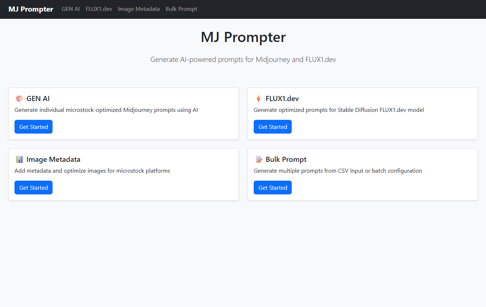

# MJ Prompter
## This project is base on [Midjourney-Prompt-Builder](https://github.com/Nafi7393/Midjourney-Prompt-Builder) By [Nafi7393](https://github.com/Nafi7393).

## Overview
- This is a **Midjourney prompt generator for create AI image to selling on Microstock**. It optimized for define parameter to get specific and high prompt for generating AI image to selling on Microstock, The prompt generated by Gemini AI base on your input.

## Feature
### From the base version of [Midjourney-Prompt-Builder](https://github.com/Nafi7393/Midjourney-Prompt-Builder). I added following.
- Increase max of number of crafting prompt per round
- Add round to generate a prompt
- Timer to delay each round
- Export the generated prompt to .txt file
- adjust some input field to belong with Microstock


## Getting Start
### tools
- Python version 3++
- streamlit
- python-dotenv
- google-generativeai

## Installation
### 1. Clone this repository
```
git clone git@github.com:nodoby1x/mj-as-prompter.git
```
### 2. Create VENV
### 3. Install Library
```
pip install -r requirements.txt
```
### 4. Create ***.env*** file and and set your Gemini API Key
```
GEMINI_API_KEY=your_gemini_api_key
```
### 5. Run application
```
streamlit run web.py
```

# Road map
- optimize prompt to get more quality response
- add feature openai api key for get more prompt per round (openai api have cost)
